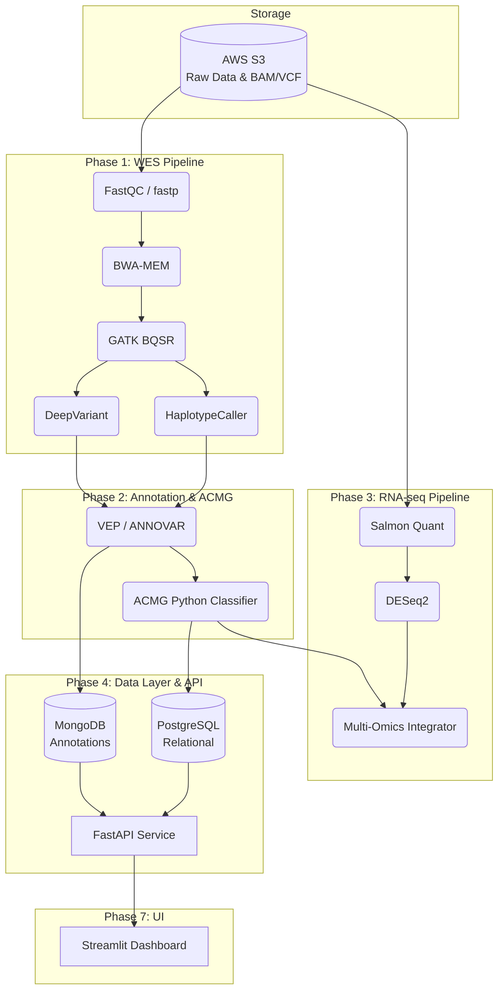

# VarPipe-Dx: Architecture

```mermaid
graph TD
    subgraph Storage
        S3[(AWS S3\nRaw Data & BAM/VCF)]
    end

    subgraph Phase 1: WES Pipeline
        FastQC(FastQC / fastp) --> BWA(BWA-MEM)
        BWA --> GATK(GATK BQSR)
        GATK --> HC(HaplotypeCaller)
        GATK --> DV(DeepVariant)
    end

    subgraph Phase 2: Annotation & ACMG
        VEP(VEP / ANNOVAR)
        ACMG(ACMG Python Classifier)
    end

    subgraph Phase 3: RNA-seq Pipeline
        Salmon(Salmon Quant) --> DESeq2(DESeq2)
        Integrator(Multi-Omics Integrator)
    end

    subgraph Phase 4: Data Layer & API
        PG[(PostgreSQL\nRelational)]
        Mongo[(MongoDB\nAnnotations)]
        API[FastAPI Service]
    end

    subgraph Phase 7: UI
        Dashboard[Streamlit Dashboard]
    end

    S3 --> FastQC
    S3 --> Salmon
    
    HC --> VEP
    DV --> VEP
    VEP --> ACMG
    
    DESeq2 --> Integrator
    ACMG --> Integrator
    
    ACMG --> PG
    VEP --> Mongo
    
    PG --> API
    Mongo --> API
    API --> Dashboard
```
